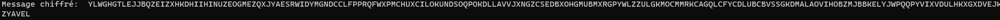
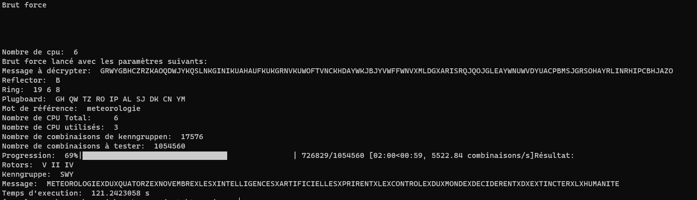

# TP Enigma

Le code pour le TP Enigma avec du multiprocessing.

# Installation

1. Clone the repository
2. Run `pip install -r requirements.txt`
3. Run `py main.py`
4. Enjoy

# Performance

Proc : I5 9600K 3.7Ghz

```
1 Thread = ~1'000-3'000 combinaisons par seconde (Temp: ~58°C)

2 Threads = ~2'000-5'000 combinaisons par seconde (Temp: ~65°C)

3 Threads = ~4'000-9'000 combinaisons par seconde (Temp: ~68°C)

4 Threads = ~9'000-15'000 combinaisons par seconde (Temp: ~70°C)
```

# Résultat

## Chiffrer

**Paramètres**

```txt
rotors = "I V IV"
reflector = "B"
ring = "13 15 11"
plugboard = "NX EC RV GP SU DK IT FY BL AZ"
```

**Message**

```txt
Les troupes britanniques sont entrees a Cuxhaven a quatorze heures le six mai Desormais tout le trafic radio cessera je vous souhaite le meilleur Fermeture pour toujours tout le meilleur au revoir.
```

**Résultat**

```txt
 YLWGHGTLEJJBQZEIZXHKDHIIHINUZEOGMEZQXJYAESRWIDYMGNDCCLFPPRQFWXPMCHUXCILOKUNDSOQPOKDLLAVVJXNGZCSEDBXOHGMUBMXRGPYWLZZULGKMOCMMRKCAGQLCFYCDLUBCBVSSGKDMALAOVIHOBZMJBBKELYJWPQQPYVIXVDULHKXGXDVEJKWZYAVEL
```



## Déchiffrer

**Paramètres**

```txt
rotors = "I V IV"
reflector = "B"
ring = "13 15 11"
plugboard = "NX EC RV GP SU DK IT FY BL AZ"
```

**Message**

```txt
YLWGHGTLEJJBQZEIZXHKDHIIHINUZEOGMEZQXJYAESRWIDYMGNDCCLFPPRQFWXPMCHUXCILOKUNDSOQPOKDLLAVVJXNGZCSEDBXOHGMUBMXRGPYWLZZULGKMOCMMRKCAGQLCFYCDLUBCBVSSGKDMALAOVIHOBZMJBBKELYJWPQQPYVIXVDULHKXGXDVEJKWZYAVEL
```

**Résultat**

```
LESXTROUPESXBRITANNIQUESXSONTXENTREESXAXCUXHAVENXAXQUATORZEXHEURESXLEXSIXXMAIXDESORMAISXTOUTXLEXTRAFICXRADIOXCESSERAXJEXVOUSXSOUHAITEXLEXMEILLEURXFERMETUREXPOURXTOUJOURSXTOUTXLEXMEILLEURXAUXREVOIRX
```


## Brute Force

**Paramètres**

```txt
Reflector:  B
Ring:  19 6 8
Plugboard:  GH QW TZ RO IP AL SJ DK CN YM
```

**Message à déchiffrer**

```txt
Message à déchiffrer:  GRWYGBHCZRZKAOQDWJYKQSLNKGINIKUAHAUFKUKGRNVKUWOFTVNCKHDAYWKJBJYVWFFWNVXMLDGXARISRQJQOJGLEAYWNUWVDYUACPBMSJGRSOHAYRLINRHIPCBHJAZO
```

**Résultat**

```txt
Rotors:  V II IV
Kenngruppe:  SWY
Message:  METEOROLOGIEXDUXQUATORZEXNOVEMBREXLESXINTELLIGENCESXARTIFICIELLESXPRIRENTXLEXCONTROLEXDUXMONDEXDECIDERENTXDXEXTINCTERXLXHUMANITE
Temps d'execution:  121.2423058 s
```

**Message caché**

```txt
METEOROLOGIE DU QUATORZE NOVEMBRE LES INTELLIGENCES ARTIFICIELLES PRIRENT LE CONTROLE DU MONDE DECIDERENT D EXTINCTER L HUMANITE
```




